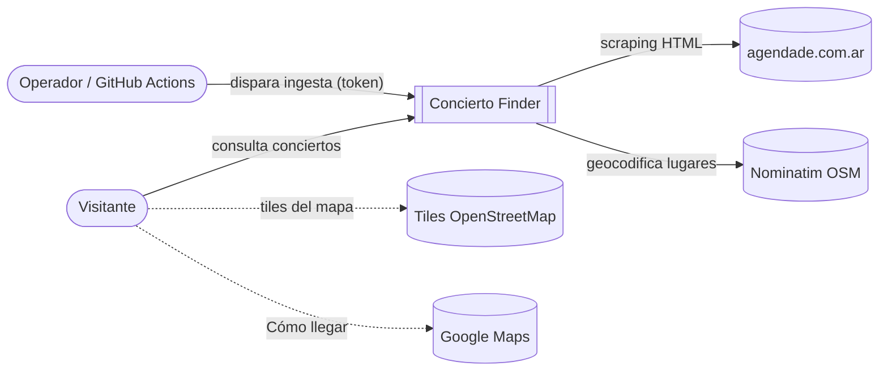
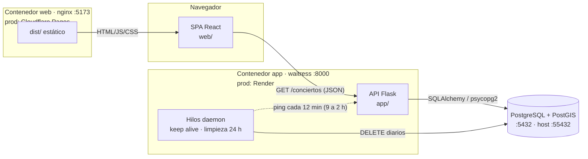
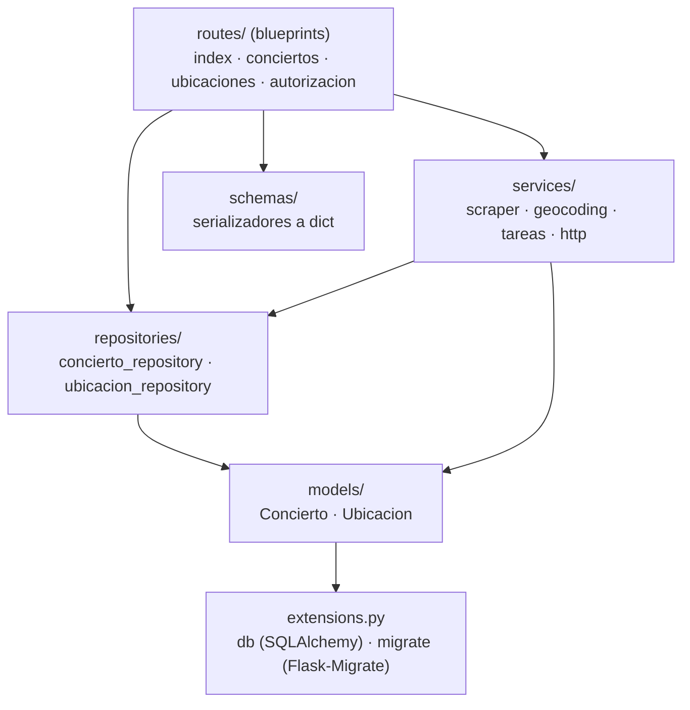
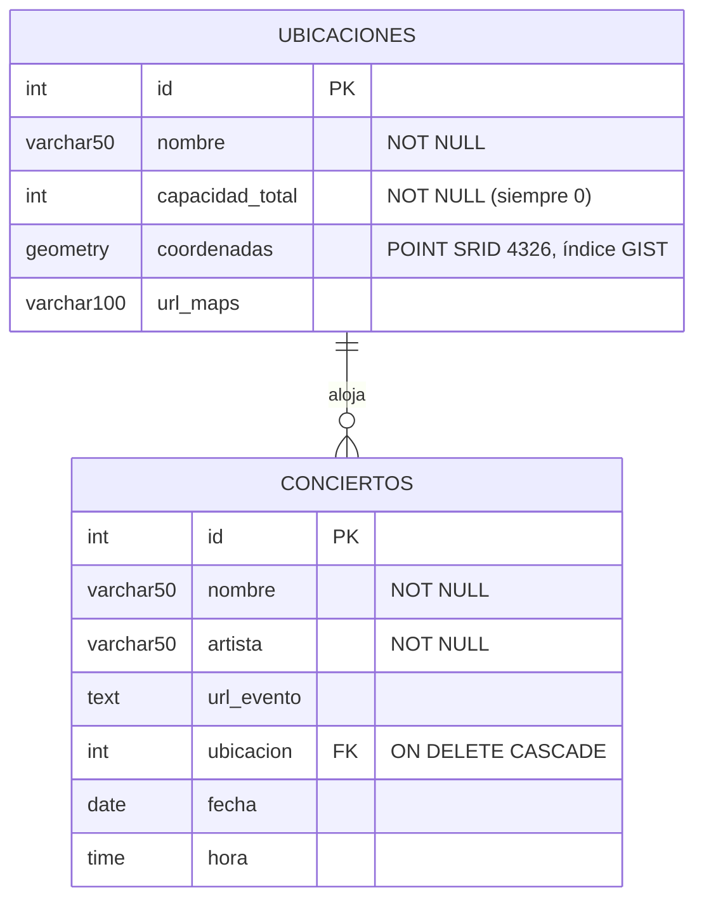
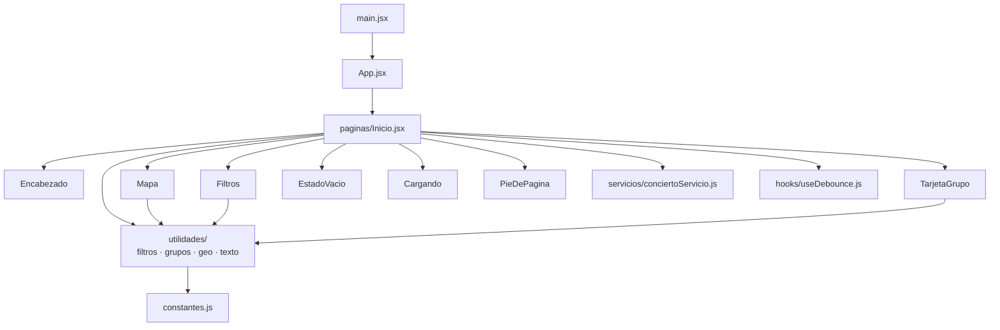
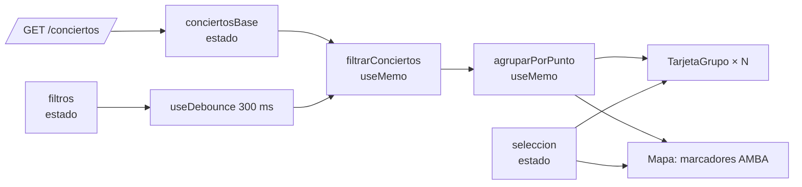
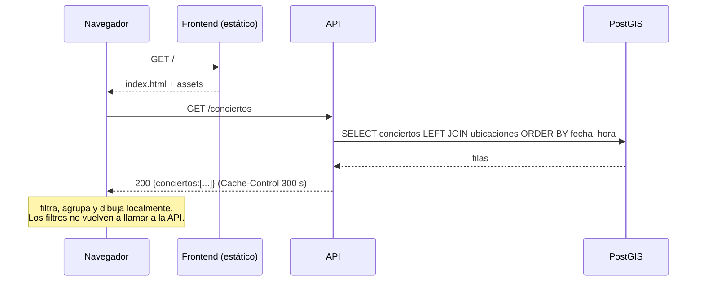
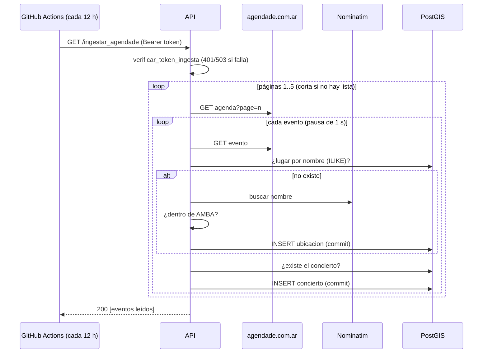

# Arquitectura — Concierto Finder

> Documento obtenido por **ingeniería inversa** del código (octubre 2026). Los requisitos que
> esta arquitectura implementa están en [REQUISITOS.md](REQUISITOS.md); el contrato HTTP, en
> [API.md](API.md); el despliegue y la operación, en [OPERACION.md](OPERACION.md).

## 1. Vista general

Aplicación web de dos piezas, más una base geoespacial:

- **Frontend SPA** (React 18 + Vite + Leaflet) que descarga todos los conciertos una vez y
  hace el filtrado, el agrupamiento y el mapa en el navegador.
- **API REST** (Flask 3 + SQLAlchemy 2.0 + GeoAlchemy2, servida con waitress), de solo lectura
  para el público, con un endpoint protegido de ingesta (scraping) y dos tareas en segundo plano.
- **PostgreSQL 16 + PostGIS 3.4** con dos tablas.

### 1.1 Contexto (C4 nivel 1)

### 1.2 Contenedores (C4 nivel 2)

| Contenedor | Tecnología | Producción | Local (`docker compose`) |
|---|---|---|---|
| web | React 18, Vite 7, react-leaflet 4, nginx | Cloudflare Pages (`conciertosfinder.pages.dev`) | servicio `web` en :5173 |
| app | Python 3.12, Flask 3, SQLAlchemy 2.0, GeoAlchemy2, waitress | Render (`concierto-finder.onrender.com`) | servicio `app` en :8000 |
| db | PostgreSQL 16 + PostGIS 3.4 | — | servicio `db`, volumen `pgdata`, host :55432 |

## 2. Backend (`app/`)

### 2.1 Capas

| Módulo | Responsabilidad |
|---|---|
| `__init__.py` | `create_app()`: config, CORS, SQLAlchemy, Flask-Migrate, blueprints, 503 ante `TimeoutError` del pool, `session.remove()` al cerrar cada pedido. |
| `main.py` | Entrypoint de producción: configura `logging`, crea la app y **arranca los hilos de fondo**. |
| `config.py` | Lee `DATABASE_URL` (obligatoria, falla al importar si falta), `SCRAPER_TOKEN` y las opciones del pool. |
| `routes/` | HTTP. `autorizacion.py` define `verificar_token_ingesta()`, que la ruta de ingesta llama antes de empezar. Las rutas no contienen consultas. |
| `repositories/` | **Todas** las consultas: listados con `joinedload` y orden por fecha, búsqueda espacial `ST_DWithin`, existencia y borrados masivos. |
| `schemas/` | Serialización manual a dict/JSON (`[lng, lat]`, fechas ISO o `null`). |
| `services/scraper_service.py` | Ingesta: descarga, parseo, resolución de lugar, deduplicación y alta. |
| `services/geocoding_service.py` | Nominatim y la regla de región AMBA (fuente de verdad de los límites). |
| `services/tareas.py` | Hilos `mantener_despierta` (keep alive dentro de una franja horaria, o mientras corre una ingesta), `programar_limpieza_diaria` e `ingesta_inicial` (solo si la base está vacía). |
| `services/http.py` | `requests.Session` compartida y timeout por defecto. |

### 2.2 Modelo de datos

- Coordenadas en **WGS84 (SRID 4326)**, orden `[lng, lat]` en WKT y en el JSON.
- Las búsquedas por distancia castean a `Geography` para medir en metros.
- El esquema se versiona en `migrations/` (Alembic). `0001_esquema_inicial` es idempotente
  (no recrea tablas existentes); `0002_url_evento_text` amplía `url_evento` a `TEXT`.

### 2.3 Concurrencia y recursos

- waitress atiende con un pool de hilos (4 por defecto). Una ingesta ocupa uno durante varios minutos.
- SQLAlchemy usa un pool de 3 conexiones + 2 de desborde, con `pool_pre_ping` y reciclado cada 30 min.
- Al importar `app.main` se levantan dos hilos daemon **por proceso**. Con varios workers
  la limpieza correría duplicada (es idempotente, así que no rompe nada).
- `flask --app app ...` (migraciones, shell) usa `create_app()` y **no** arranca los hilos.

## 3. Frontend (`web/src/`)

**Flujo de datos de `Inicio`** (única página, sin router ni librería de estado):

- El estado se reduce a lo mínimo (`conciertosBase`, `filtros`, `seleccion`, `cargando`, `error`);
  la lista filtrada y los grupos se **derivan**, no se guardan.
- `Mapa` recibe los grupos ya calculados, usa un único `divIcon` y abre los popups mediante
  refs de `Marker`. Cada clic en "Ver en mapa" crea un objeto `seleccion` nuevo, así vuelve a
  enfocar aunque sea el mismo concierto.
- Estilos: CSS Modules co-ubicados (`<nombre>.module.css`) y variables globales en `index.css`.
- `VITE_API_URL` se fija en el build. Si falta, se usa la API de producción.

## 4. Flujos principales

### 4.1 Carga de la página

### 4.2 Ingesta

Los errores de un evento se loguean, se hace rollback y se sigue con el siguiente. Un error al
bajar una página de la agenda corta la corrida.

### 4.3 Limpieza diaria

Hilo `programar_limpieza_diaria`: al arrancar y luego cada 24 h ejecuta, en una transacción,
`DELETE ... WHERE fecha < hoy` y un `DELETE ... WHERE EXISTS (otro con menor id y misma identidad)`.

## 5. Decisiones de diseño

| # | Decisión | Motivo | Consecuencia |
|---|---|---|---|
| D-1 | Filtrado en el cliente | Volumen chico. Respuesta instantánea y menos carga sobre una API gratuita que se duerme. | `/conciertos_cerca` queda sin uso; no escala a decenas de miles de eventos. |
| D-2 | PostGIS para coordenadas | Consultas espaciales nativas (`ST_DWithin`). | Requiere la extensión; los datos se guardan en un tipo geográfico real. |
| D-3 | Scraping en vez de API de terceros | La fuente no ofrece API. | Frágil ante cambios de HTML. |
| D-4 | Tareas en hilos del mismo proceso | Sin infraestructura extra (sin Celery ni cron del sistema). | Se duplican por worker; se pierden si el proceso se reinicia antes de las 24 h (la limpieza corre al arrancar). |
| D-5 | Serialización manual | Dos entidades; no justifica marshmallow. | Hay que mantener los serializadores a mano. |
| D-6 | Ingesta protegida con token compartido | Simple y compatible con crons que solo configuran una URL (`?token=`). | El token en la query puede quedar en los logs de proxies; se prefiere el header. |
| D-7 | Migraciones con Alembic y base idempotente | Versionar el esquema sin romper las bases creadas con `create_all()`. | Los cambios de modelo requieren `flask db migrate` y revisar el script. |

## 6. Deuda técnica y evolución sugerida

- Tests automatizados: parseo del scraper con HTML de ejemplo, repositorios contra PostGIS y utilidades del frontend.
- Ampliar `ubicaciones.nombre` (50 caracteres) y matchear lugares por nombre exacto o normalizado en lugar de `ILIKE %x%`.
- Correr la ingesta fuera del pedido HTTP (cola o job programado), para no ocupar un hilo de waitress durante minutos.
- Índice sobre `conciertos.fecha` si el volumen crece.
- Unificar la ubicación de los límites de AMBA (por ejemplo, exponerlos por la API) para no mantenerlos duplicados.
