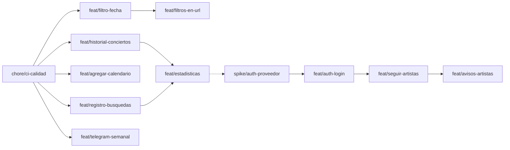

# Plan de implementación por ramas — Concierto Finder

Hoja de ruta de las próximas funcionalidades, con **una rama de Git por feature**. Cada rama se
integra a `main` con un Pull Request (PR) revisado. Ver también [ARQUITECTURA.md](ARQUITECTURA.md)
y [OPERACION.md](OPERACION.md).

## 1. Cómo trabajamos con ramas

### Reglas

1. **`main` siempre funciona y es lo que está en producción.** Render (API) y Cloudflare Pages
   (web) despliegan desde `main`. Nunca se commitea directo a `main`: todo entra por PR.
2. **Una rama = una feature = un PR.** Mejor varios PR chicos que uno gigante: se revisan más
   rápido y, si algo se rompe, es fácil saber qué fue.
3. **Las ramas nacen de `main` actualizado** y viven poco (idealmente días, no semanas).
4. **Antes de abrir el PR**, actualizá tu rama con lo último de `main` y corré los lints.
5. **Se integra con "Squash and merge"**: todos los commits de la rama quedan como uno solo en
   `main`, con el título del PR como mensaje. La rama se borra después del merge.

### Nombres de rama

`<tipo>/<descripcion-corta-en-español>`, en minúsculas y con guiones.

| Tipo | Para qué | Ejemplo |
|---|---|---|
| `feat/` | Funcionalidad nueva | `feat/filtro-fecha` |
| `fix/` | Corrección de un bug | `fix/popup-mapa-mobile` |
| `chore/` | Herramientas, CI, dependencias | `chore/ci-calidad` |
| `docs/` | Solo documentación | `docs/plan-ramas` |
| `refactor/` | Reorganizar código sin cambiar comportamiento | `refactor/servicio-api` |

El título del PR sigue Conventional Commits en español, igual que los commits:
`feat(ui): filtro por fecha (hoy, finde, mes)`.

### Comandos del día a día

```bash
# 1. Crear la rama desde main actualizado
git switch main
git pull
git switch -c feat/filtro-fecha

# 2. Trabajar y commitear (las veces que haga falta)
git add .
git commit -m "feat(ui): chips de fecha en el panel de filtros"

# 3. Antes del PR: traer lo nuevo de main y verificar
git fetch origin
git rebase origin/main          # o: git merge origin/main
ruff check app migrations && ruff format app migrations
cd web && npm run lint && npm run format && npm run build && cd ..

# 4. Subir la rama y abrir el PR
git push -u origin feat/filtro-fecha
gh pr create --fill --base main

# 5. Cuando el PR está aprobado y los checks en verde
gh pr merge --squash --delete-branch
git switch main && git pull
```

Si usaste `rebase` sobre una rama que ya habías subido, el push siguiente necesita
`git push --force-with-lease` (solo en tu rama, nunca en `main`).

### Cómo probar una rama antes del merge

| Qué cambió | Cómo se prueba |
|---|---|
| Solo frontend | Cloudflare Pages genera una **preview** por cada rama subida (una URL propia, que aparece en el PR). Esa preview usa la API de producción. |
| Backend o base de datos | En local con `docker compose up --build`. Render no tiene previews en el plan gratuito. |
| Ambos | Primero el backend en local; el frontend local apuntando a `http://localhost:8000` (`web/.env.local`). |

### Migraciones de base de datos en ramas

Cada migración apunta a la anterior (`down_revision`). Si **dos ramas crean una migración a la
vez**, las dos van a decir "vengo de la 0002" y Alembic va a encontrar dos caminos.

- Regla simple: **solo una rama con migraciones abierta a la vez.**
- Si igual pasa: la rama que se integra segunda renombra su migración (por ejemplo, `0003` →
  `0004`) y cambia su `down_revision` para que apunte a la que ya entró. Después prueba
  `flask --app app db upgrade` contra una base local.

### Cambios que tocan backend y frontend

Si una feature cambia lo que devuelve la API:
1. El backend se hace **compatible hacia atrás** (agregar campos, no quitar ni renombrar).
2. Se integra y despliega **primero el backend**.
3. Después el frontend que usa lo nuevo.

Si es una sola rama con las dos cosas, el cambio de API tiene que ser compatible, porque Render y
Pages no despliegan exactamente al mismo tiempo.

## 2. Mapa de ramas



Las ramas sin flecha entre sí son **independientes** y se pueden hacer en paralelo (por ejemplo,
`feat/filtro-fecha` y `feat/agregar-calendario`).

| # | Rama | Etapa | Toca | Migración | Tamaño | Depende de |
|---|---|---|---|---|---|---|
| 0 | `chore/ci-calidad` | 0 | CI | — | S | — |
| 1 | `feat/historial-conciertos` | 1 | Backend | 0003 | S | 0 |
| 2 | `feat/filtro-fecha` | 1 | Frontend | — | S | 0 |
| 3 | `feat/agregar-calendario` | 1 | Frontend | — | S | 0 |
| 4 | `feat/filtros-en-url` | 1 | Frontend | — | S | 2 |
| 5 | `feat/registro-busquedas` | 2 | Backend + frontend | 0004 | M | 0 |
| 6 | `feat/estadisticas` | 2 | Backend + frontend | — | M | 1, 5 |
| 7 | `feat/telegram-semanal` | 2 | CI | — | S | 0 |
| 8 | `spike/auth-proveedor` | 3 | Investigación | — | S | — |
| 9 | `feat/auth-login` | 3 | Backend + frontend | 0005 | L | 8 |
| 10 | `feat/seguir-artistas` | 3 | Backend + frontend | 0006 | M | 9 |
| 11 | `feat/avisos-artistas` | 3 | Backend + CI | — | M | 10 |

Tamaño: **S** = un par de archivos, **M** = varias partes coordinadas, **L** = feature grande,
conviene partirla.

## 3. Detalle por rama

Cada rama lista qué hacer, qué archivos toca y **cuándo está terminada** (criterios de
aceptación). Toda rama que cambie comportamiento también actualiza `docs/`.

### Etapa 0 — Base para trabajar con PRs

#### 0. `chore/ci-calidad`

Para que cada PR se verifique solo, sin depender de que alguien se acuerde de correr los lints.

- `.github/workflows/calidad.yml`: en cada PR a `main`, correr
  - backend: `ruff check` y `ruff format --check`;
  - frontend: `npm ci`, `npm run lint`, `npm run format:check` y `npm run build`.
- `.github/pull_request_template.md` con un checklist: lints, docs actualizados, migración probada,
  probado en mobile y escritorio, en modo claro y oscuro.
- En GitHub (*Settings → Rules → Rulesets*), proteger `main`: exigir PR y que el check de
  calidad esté en verde para poder integrar.

**Terminada cuando:** un PR con un error de lint aparece en rojo y no se puede integrar.

### Etapa 1 — Cambios chicos de alto impacto

#### 1. `feat/historial-conciertos`

Hoy la limpieza diaria **borra** los conciertos pasados y se pierde la historia. Es la base de
las estadísticas (rama 6), y **conviene hacerla primero**: los datos que no se guardan hoy no se
recuperan después.

- `concierto_repository.py`: `obtener_conciertos()` y `obtener_conciertos_cerca()` devuelven
  solo los de fecha de hoy en adelante, o sin fecha (fecha argentina, igual que la limpieza).
- `tareas.py`: la limpieza diaria deja de llamar a `eliminar_conciertos_pasados`; solo borra
  duplicados.
- Migración `0003`: índice sobre `conciertos.fecha`, porque ahora todas las consultas filtran por
  fecha y la tabla va a crecer.
- Docs: RN-02 y la tabla de tareas automáticas.

**Terminada cuando:** un concierto de ayer sigue en la base pero no aparece en `/conciertos`.

#### 2. `feat/filtro-fecha`

- `utilidades/fechas.js` (nuevo): funciones simples `esHoy`, `esEsteFinDeSemana` y `esEsteMes`,
  con la fecha en hora local (reutilizando la idea de `fechaLegible`).
- `utilidades/filtros.js`: nuevo criterio `cuando` (`"todas" | "hoy" | "finde" | "mes"`).
- `componentes/Filtros/Filtros.jsx`: una fila de botones (chips) "Todas · Hoy · Este finde ·
  Este mes", con el mismo estilo que los atajos de radio.
- `Inicio.jsx`: `cuando: "todas"` en el estado inicial de los filtros.

**Terminada cuando:** "Este finde" muestra de viernes a domingo de esta semana, y se combina con
el filtro por artista y el de cercanía.

#### 3. `feat/agregar-calendario`

- `utilidades/calendario.js` (nuevo): `linkGoogleCalendar(concierto)` arma la URL
  `https://calendar.google.com/calendar/render?action=TEMPLATE&...`, con título, lugar, fecha,
  hora (duración por defecto de 3 h) y `ctz=America/Argentina/Buenos_Aires`.
- `TarjetaGrupo.jsx`: botón "Agendar" en cada fila; si el concierto no tiene fecha, no se
  muestra.

**Terminada cuando:** el link abre Google Calendar con los datos correctos y en la hora
argentina.

#### 4. `feat/filtros-en-url`

Para compartir una búsqueda, por ejemplo por WhatsApp: `?artista=paez&cuando=finde`.

- `hooks/useFiltrosEnUrl.js` (nuevo): al cargar, lee `URLSearchParams`; cuando cambian los
  filtros, actualiza la URL con `history.replaceState` (sin recargar la página).
- **La ubicación del usuario no va a la URL**: es un dato personal.
- Depende de la rama 2 para incluir `cuando`.

**Terminada cuando:** abrir un link con parámetros muestra la búsqueda aplicada, y el botón
"atrás" del navegador no queda lleno de estados intermedios.

### Etapa 2 — Datos y difusión

#### 5. `feat/registro-busquedas`

Saber qué artistas busca la gente, en especial **los que no tienen fecha**.

- Migración `0004`: tabla `busquedas` (`id`, `texto` normalizado, `cantidad_resultados`,
  `fecha_hora`). **Sin IP ni datos personales.**
- `POST /busquedas`: guarda una búsqueda. Valida el largo del texto e ignora los textos de menos
  de 3 letras.
- Frontend: después del debounce, si el texto no cambió en 1,5 s, envía la búsqueda (una sola
  vez por texto). Si falla, no muestra nada al usuario.
- Docs: `API.md` y el modelo de datos en `ARQUITECTURA.md`.

**Terminada cuando:** escribir "fito" y esperar deja una fila en `busquedas`; escribir
"f-i-t-o" letra por letra no deja cuatro filas.

#### 6. `feat/estadisticas`

- `repositories/estadisticas_repository.py` (nuevo): consultas `GROUP BY`: lugares con más
  conciertos, artistas que más tocan, conciertos por día de la semana y por mes, y artistas más
  buscados sin resultados.
- `GET /estadisticas`: devuelve todo junto (con caché, igual que `/conciertos`).
- Frontend: página nueva "Estadísticas". Es el primer caso con dos páginas, así que se agrega
  `react-router-dom` con las rutas `/` y `/estadisticas`, y un link en el encabezado.
- Gráficos simples: barras hechas con CSS, sin librería, o una librería liviana si hace falta.
- Recargar en `/estadisticas` ya funciona: Cloudflare Pages sirve `index.html` en cualquier
  ruta mientras el proyecto no tenga un `404.html`, y el nginx local hace lo mismo con
  `try_files`. No agregues un `404.html` sin tener esto en cuenta.

**Terminada cuando:** la página muestra los cuatro rankings con los datos reales acumulados.

#### 7. `feat/telegram-semanal`

Un canal de Telegram con "los shows de esta semana", sin cuentas ni login.

- Crear un bot con @BotFather y un canal; guardar `TELEGRAM_TOKEN` y `TELEGRAM_CHAT_ID` como
  secrets del repo.
- `.github/workflows/telegram-semanal.yml`: los lunes a las 10:00 (hora argentina, dentro de la
  franja del keep alive), despierta la API, pide `/conciertos`, arma el mensaje con los de los
  próximos 7 días (agrupados por día, con link a la web) y lo envía con la API de Telegram
  (`sendMessage`).
- El armado del mensaje va en un script corto (`scripts/mensaje_semanal.py`) para poder probarlo
  en local.

**Terminada cuando:** al lanzar el workflow a mano llega el mensaje al canal.

### Etapa 3 — Cuentas de usuario

Es la etapa más grande y la única que maneja **datos personales**. Se parte en ramas chicas y
arranca con una investigación.

#### 8. `spike/auth-proveedor`

Un *spike* es una rama de prueba para decidir algo; **no se integra a `main`**: se cierra al
decidir.

- Comparar Supabase Auth y Firebase Auth para login con Google: plan gratuito, cómo valida
  Flask el token, y qué pasa con el arranque en frío de Render.
- **No hacer el manejo de contraseñas propio**: es lo más riesgoso de todo el proyecto.
- Resultado: una decisión escrita (en `docs/ARQUITECTURA.md`, tabla de decisiones) y un ejemplo
  mínimo funcionando.

#### 9. `feat/auth-login`

- Frontend: botón "Ingresar con Google" en el encabezado; sesión manejada por la librería del
  proveedor elegido.
- Backend: función `usuario_actual()` que valida el token del proveedor (misma idea que
  `verificar_token_ingesta`) y tabla `usuarios` (migración `0005`): `id`, `id_proveedor`, `email`
  y fecha de alta.
- Página o sección "Mi cuenta" con **borrar mi cuenta** (obligatorio si guardamos datos
  personales) y una política de privacidad simple.

#### 10. `feat/seguir-artistas`

- Migración `0006`: tabla `artistas_seguidos` (`usuario_id`, `artista` normalizado), con
  restricción única para no seguir dos veces al mismo.
- `GET`, `POST` y `DELETE /yo/artistas` (requieren login).
- Frontend: botón "Seguir" junto al artista en cada fila, y un filtro "Solo artistas que sigo".

#### 11. `feat/avisos-artistas`

- La ingesta ya sabe qué conciertos son **nuevos**: al terminar, busca los usuarios que siguen
  a esos artistas y les avisa.
- Canal: mail (Resend o Brevo, ambos con plan gratuito) o Telegram, según lo que se decida en la
  rama 8.
- Un aviso por concierto nuevo, nunca repetido (guardar qué se avisó).
- Link para dejar de recibir avisos en cada mensaje.

## 4. Orden sugerido

1. **`chore/ci-calidad`**: primero, porque protege `main` para todo lo que sigue.
2. **`feat/historial-conciertos`**: lo antes posible, porque cada día sin ella son datos perdidos.
3. En paralelo: **`feat/filtro-fecha`** y **`feat/agregar-calendario`**.
4. **`feat/filtros-en-url`** (después de la de fecha).
5. **`feat/registro-busquedas`** y **`feat/telegram-semanal`**, en paralelo.
6. **`feat/estadisticas`**, cuando haya algunas semanas de datos acumulados.
7. Etapa 3, recién con lo anterior estable.
